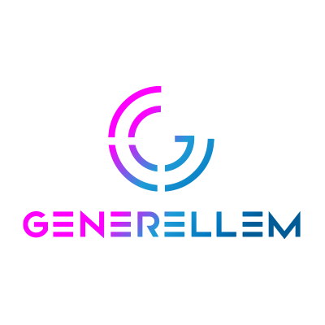

### Generellem

Generellem is an opinionated framework for implementing Retrieval Augmented Generation (RAG) processes. Essentially, you can use AI on your own documents.

#### Project Status:

Generellem is now a v1.0 released product. If you find a bug, create a new [Issue](https://github.com/JoeAtGenerellem/generellem/issues).

The framework is cross-platform. We will be targeting the latest version of C# and the latest .NET LTS release, which is currently .NET 8.0. The initial releases are building around Azure and Windows technologies and we'll expand to other plaforms and technologies as we go. BTW, the demos already run on Linux, MacOS, and Windows.

Generellem open-source is the underlying engine of the commercial [Generellem SaaS](https://generellem.ai/) product. You can expect regular updates over time.

#### Getting Started

There's a growing list of demos that you can clone and run to get a feel for how the framework works. You might want to start with [GenerellemConsole](https://github.com/JoeAtGenerellem/generellem/tree/main/GenerellemConsole) which has foundational support. We'll have more demos as the technology support grows. e.g. [MSGraphDemo](https://github.com/JoeAtGenerellem/generellem/tree/main/MSGraphDemo) shows how to work with OneDrive via Microsoft Graph.

We have a growing library of documentation to include Architecture, Getting Started, and more. Please visit the [Wiki](https://github.com/generellem/generellem/wiki) for more information.

#### Contributing

Generellem is an open-source project and we welcome your contributions. Please visit the [Contributing](https://github.com/JoeAtGenerellem/generellem/blob/main/CONTRIBUTING.md) page for more information. Join our [Discord](https://discord.gg/Nhn5BMECBR) to find the latest news and updates on what is going on with the Generellem open-source community.

If you are a [Generellem SaaS](https://generellem.ai/) customer and need support for a specific data source, document type, or platform, you're welcome to add that here for quicker implementation.

#### Contact Info

Joe Mayo stared the Generellem project because of his belief in open-soure and contributing to the community. Here are a few places you can find Joe at.

* [Joe on X](https://twitter.com/JoeMayo)
* [Joe on LinkedIn](https://www.linkedin.com/in/joemayo/)
* [Generellem on X](https://twitter.com/generellem)
* [Generellem on LinkedIn](https://www.linkedin.com/company/generellem/)
* [Generellem website](https://generellem.ai/)
* [Discord](https://discord.gg/Nhn5BMECBR) Community